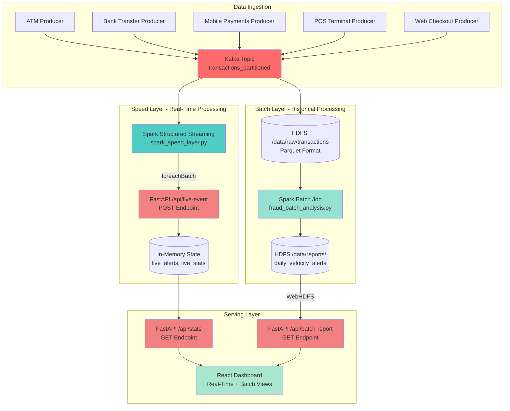

# FraudRadar: Hybrid Real-Time & Batch Analytics Pipeline

**Enterprise-Grade Lambda Architecture Implementation for Fraud Detection**

> *Blending the speed of real-time streaming analytics with the accuracy of batch processing to deliver comprehensive fraud detection capabilities.*

---

## Table of Contents

- [Architecture Overview](#architecture-overview)
- [Project Structure](#project-structure)
- [Component Breakdown](#component-breakdown)
- [Windows-Specific Engineering](#windows-specific-engineering)
- [Setup Instructions](#setup-instructions)
- [Requirements](#requirements)
- [Usage](#usage)
- [Contributing](#contributing)

---

## Architecture Overview

This project implements a **Lambda Architecture** pattern, combining:

- **Speed Layer (Real-Time)**: Spark Structured Streaming processing Kafka events with sub-second latency
- **Batch Layer (Historical)**: PySpark batch jobs analyzing accumulated data in HDFS
- **Serving Layer**: FastAPI backend merging real-time metrics with batch reports for unified dashboard views

### Architecture Diagram



### Data Flow

1. **Ingestion**: Multiple transaction producers simulate real-world payment sources, publishing JSON events to Kafka
2. **Speed Layer**: Spark Streaming consumes Kafka, detects fraud (amount > $500), and forwards alerts to FastAPI via `foreachBatch`
3. **Batch Layer**: Parallel Spark job writes all transactions to HDFS Parquet, then aggregates daily velocity metrics
4. **Serving Layer**: FastAPI endpoints merge in-memory live stats with HDFS batch reports
5. **Visualization**: React dashboard polls both endpoints, displaying real-time alerts and historical patterns

---

## Project Structure

```
fraud-detection-practice/
│
├── Fraud-detection-re/
│   │
│   ├── kafka-practice/
│   │   ├── producers/                    # Kafka event producers
│   │   │   ├── atm_transactions.py       # ATM transaction simulator
│   │   │   ├── bank_transfer.py          # Bank transfer simulator
│   │   │   ├── mobile_payments.py        # Mobile payment simulator
│   │   │   ├── pos_terminals.py          # POS terminal simulator
│   │   │   └── web_checkout.py           # Web checkout simulator
│   │   │
│   │   ├── consumers/
│   │   │   └── fraud_consumer.py         # Simple Kafka consumer (testing)
│   │   │
│   │   ├── docker-compose.yml            # Kafka + HDFS infrastructure
│   │   ├── hadhoop.env                   # Hadoop configuration overrides
│   │   └── README.md                     # Kafka setup documentation
│   │
│   ├── spark-streaming-practice/
│   │   ├── kafka_stream/
│   │   │   ├── fraud_streaming.py        # HDFS write streaming job
│   │   │   ├── spark_speed_layer.py      # Speed layer (Kafka → FastAPI)
│   │   │   │
│   │   │   ├── backend_api/
│   │   │   │   └── app.py                # FastAPI serving layer
│   │   │   │
│   │   │   ├── dashboard/                # React frontend
│   │   │   │   ├── src/
│   │   │   │   │   ├── App.jsx           # Main dashboard component
│   │   │   │   │   ├── main.jsx          # React entry point
│   │   │   │   │   └── index.css         # Tailwind CSS styles
│   │   │   │   ├── package.json          # Node.js dependencies
│   │   │   │   └── vite.config.js        # Vite build configuration
│   │   │   │
│   │   │   └── checkpoint/               # Spark checkpoint directory
│   │   │
│   │   └── README.md
│   │
│   └── spark-batch-practice/
│       ├── fraud_batch_analysis.py       # Daily velocity aggregation
│       ├── transformations.py            # Batch transformation utilities
│       └── README.md
│
└── README.md                             # This file
```

---

## Component Breakdown

### Speed Layer: Real-Time Processing

**File**: `spark-streaming-practice/spark_speed_layer.py`

The Speed Layer uses **Spark Structured Streaming** to process Kafka events in near real-time and forward fraud alerts to the FastAPI backend.

#### Key Implementation Details

- **Kafka Integration**: Consumes from `transactions_partitioned` topic with micro-batch processing
- **foreachBatch Bridge**: Utilizes `foreachBatch` to send each micro-batch to FastAPI's `/api/live-event` endpoint via HTTP POST
- **Schema Enforcement**: Structured JSON schema validation (`user`, `amount`, `source`)
- **Fraud Detection Logic**: Real-time filtering for transactions exceeding threshold (amount > $500)

```python
# Core streaming logic
def send_to_fastapi(batch_df, batch_id):
    rows = batch_df.collect()
    for row in rows:
        payload = {"user": row.user, "amount": row.amount, "type": "FRAUD_ALERT"}
        requests.post("http://localhost:8000/api/live-event", json=payload)

query = clean_df.writeStream \
    .foreachBatch(send_to_fastapi) \
    .start()
```

**Latency**: Sub-second processing from Kafka ingestion to dashboard display

---

### Batch Layer: Historical Analytics

**Files**: 
- `spark-streaming-practice/kafka_stream/fraud_streaming.py` (HDFS write)
- `spark-batch-practice/fraud_batch_analysis.py` (Aggregation)

The Batch Layer handles **master data storage** in HDFS and performs **historical aggregations** for comprehensive fraud pattern analysis.

#### HDFS Write Streaming Job

**Purpose**: Persist all transaction data to HDFS for batch processing

- **Dual Stream Output**: 
  - All transactions → `hdfs://localhost:9000/data/raw/transactions` (Parquet)
  - Fraud-only transactions → `hdfs://localhost:9000/data/processed/fraud` (Parquet)
- **Checkpoint Management**: Separate checkpoint locations for fault tolerance
- **Format**: Parquet for columnar storage efficiency

#### Batch Aggregation Job

**Purpose**: Daily velocity analysis to identify high-spending patterns

- **Input**: Reads from `/data/raw/transactions` (accumulated Parquet files)
- **Processing**: Groups by user, sums daily spend, filters users exceeding $5,000 threshold
- **Output**: Writes velocity alerts to `/data/reports/daily_velocity_alerts`

```python
# Batch aggregation example
user_history = raw_data.groupBy("user").agg(
    F.sum("amount").alias("total_daily_spend")
)
flagged_users = user_history.filter(F.col("total_daily_spend") > 5000)
flagged_users.write.mode("overwrite").parquet("hdfs://localhost:9000/data/reports/daily_velocity_alerts")
```

**Why Parquet?**
- Columnar format enables efficient aggregation queries
- Compression reduces storage costs
- Schema evolution support for changing transaction structures

---

### Serving Layer: Unified API

**File**: `spark-streaming-practice/kafka_stream/backend_api/app.py`

The Serving Layer merges real-time and batch data through **RESTful FastAPI endpoints**.

#### Architecture

| Endpoint | Method | Data Source | Purpose |
|----------|--------|-------------|---------|
| `/api/live-event` | POST | Spark Streaming (via foreachBatch) | Receive real-time fraud alerts |
| `/api/stats` | GET | In-memory state (live_alerts, live_stats) | Return current fraud metrics |
| `/api/batch-report` | GET | HDFS (WebHDFS protocol) | Return daily velocity analysis |

#### Implementation Highlights

**Live Stats Endpoint** (`/api/stats`):
- Maintains rolling counters in-memory (`total_volume`, `fraud_count`)
- Returns last 10 fraud alerts for dashboard display
- Zero-latency response (no database queries)

**Batch Report Endpoint** (`/api/batch-report`):
- Uses `pandas.read_parquet()` with WebHDFS protocol (`webhdfs://localhost:9870`)
- Reads from HDFS batch report location
- Handles connection errors gracefully

**CORS Configuration**:
- Enabled for React frontend cross-origin requests
- Allows all origins in development (configure restrictively for production)

```python
app.add_middleware(
    CORSMiddleware,
    allow_origins=["*"],
    allow_credentials=True,
    allow_methods=["*"],
    allow_headers=["*"],
)
```

---

## Windows-Specific Engineering

This project includes **critical Windows 11 compatibility fixes** for Spark and HDFS integration.

### Problem: BlockManager NullPointerException

**Issue**: Spark driver attempts to bind to hostname instead of localhost, causing network binding failures on Windows.

**Solution**: Explicit driver host binding

```python
.config("spark.driver.host", "127.0.0.1")
.config("spark.driver.bindAddress", "127.0.0.1")
```

### Problem: HDFS Permission Denied

**Issue**: FSPermissionChecker blocks write operations when user identity doesn't match HDFS permissions.

**Solution**: Set HADOOP_USER_NAME environment variable

```python
import os
os.environ['HADOOP_USER_NAME'] = 'root'  # Set at very top, before SparkSession
```

### Problem: DataNode Connection Exclusions

**Issue**: HDFS client cannot connect to DataNode when using container hostnames from Windows host.

**Solution**: Configure DataNode address and client hostname resolution

```python
.config("spark.hadoop.fs.defaultFS", "hdfs://localhost:9000")
.config("spark.hadoop.dfs.datanode.address", "127.0.0.1:9866")
.config("spark.hadoop.dfs.client.use.datanode.hostname", "true")
.config("spark.hadoop.dfs.client.block.write.replace-datanode-on-failure.enabled", "false")
```

**Key Ports**:
- NameNode RPC: `9000`
- NameNode Web UI: `9870`
- DataNode HTTP: `9864`
- DataNode Data Transfer: `9866` (critical for writes)

### Problem: WebHDFS Access from FastAPI

**Issue**: Reading Parquet files from HDFS requires WebHDFS protocol configuration.

**Solution**: Use pandas with storage_options

```python
df = pd.read_parquet(
    "webhdfs://localhost:9870/data/reports/daily_velocity_alerts",
    engine='pyarrow',
    storage_options={"user": "Barney"}
)
```

---

## Setup Instructions

### Prerequisites

- **Windows 11** (or Windows 10)
- **Docker Desktop** with WSL2 backend
- **Python 3.8+**
- **Node.js 18+** (for React dashboard)
- **Java 8 or 11** (required for Spark)

### Step 1: Start Infrastructure (Kafka + HDFS)

Navigate to the Kafka practice directory:

```bash
cd Fraud-detection-re/kafka-practice
docker-compose up -d
```

**Wait 30-45 seconds** for services to initialize. Verify containers are running:

```bash
docker-compose ps
```

You should see:
- `zookeeper_practice` (port 2181)
- `kafka_practice` (port 9092)
- `namenode` (ports 9000, 9870)
- `datanode` (ports 9864, 9866)

**Verify HDFS**:
- NameNode Web UI: http://localhost:9870
- DataNode Web UI: http://localhost:9864

### Step 2: Create HDFS Directories

```bash
# Create required HDFS paths
docker exec -it namenode hdfs dfs -mkdir -p /data/raw/transactions
docker exec -it namenode hdfs dfs -mkdir -p /data/processed/fraud
docker exec -it namenode hdfs dfs -mkdir -p /data/reports
docker exec -it namenode hdfs dfs -mkdir -p /checkpoints/all_transactions
docker exec -it namenode hdfs dfs -mkdir -p /checkpoints/fraud_data
docker exec -it namenode hdfs dfs -chmod -R 777 /data /checkpoints
```

### Step 3: Setup Python Environment

**Option A: Use Existing Virtual Environment**

```bash
cd Fraud-detection-re/kafka-practice
source myenv/bin/activate  # Git Bash
# OR
myenv\Scripts\activate  # Windows CMD/PowerShell
```

**Option B: Create New Virtual Environment**

```bash
python -m venv venv
source venv/bin/activate  # Git Bash
# OR
venv\Scripts\activate  # Windows CMD/PowerShell

pip install -r requirements.txt
```

### Step 4: Start Transaction Producers

Open **5 separate terminal windows** and run:

```bash
# Terminal 1
cd Fraud-detection-re/kafka-practice
source myenv/bin/activate
python producers/atm_transactions.py

# Terminal 2
python producers/bank_transfer.py

# Terminal 3
python producers/mobile_payments.py

# Terminal 4
python producers/pos_terminals.py

# Terminal 5
python producers/web_checkout.py
```

### Step 5: Start Speed Layer (Real-Time Processing)

```bash
cd Fraud-detection-re/spark-streaming-practice
spark-submit spark_speed_layer.py
```

This bridges Kafka → FastAPI for real-time alerts.

### Step 6: Start Batch Layer (HDFS Write)

**Option A: HDFS Write Streaming Job**

```bash
cd Fraud-detection-re/spark-streaming-practice/kafka_stream
spark-submit fraud_streaming.py
```

This writes all transactions to HDFS Parquet format.

**Option B: Run Batch Aggregation (Periodic)**

```bash
cd Fraud-detection-re/spark-batch-practice
spark-submit fraud_batch_analysis.py
```

Run this periodically (e.g., daily cron) to generate velocity reports.

### Step 7: Start FastAPI Backend

```bash
cd Fraud-detection-re/spark-streaming-practice/kafka_stream/backend_api
python app.py
```

FastAPI will start on `http://localhost:8000`

**Verify endpoints**:
- http://localhost:8000/api/stats
- http://localhost:8000/api/batch-report
- http://localhost:8000/docs (Swagger UI)

### Step 8: Start React Dashboard

```bash
cd Fraud-detection-re/spark-streaming-practice/kafka_stream/dashboard
npm install  # First time only
npm run dev
```

Dashboard will be available at `http://localhost:5173` (or port shown in terminal)

---

## Requirements

### Python Dependencies

See `requirements.txt` for complete list. Key packages:

| Package | Version | Purpose |
|---------|---------|---------|
| `pyspark` | 4.1.0+ | Spark Structured Streaming & Batch |
| `kafka-python` | 2.3.0+ | Kafka producer/consumer |
| `fastapi` | 0.104.0+ | REST API serving layer |
| `uvicorn` | 0.24.0+ | ASGI server for FastAPI |
| `pandas` | 2.1.0+ | DataFrame operations |
| `pyarrow` | 14.0.0+ | Parquet I/O with HDFS |
| `requests` | 2.31.0+ | HTTP client for foreachBatch |

### Node.js Dependencies

See `Fraud-detection-re/spark-streaming-practice/kafka_stream/dashboard/package.json`

Key packages:
- `react` ^19.2.0
- `axios` ^1.13.2
- `lucide-react` ^0.562.0 (icons)
- `tailwindcss` ^4.1.18
- `vite` ^7.2.4

### Infrastructure Requirements

- **Docker Compose**: Kafka (Confluent Platform 7.5.0) + HDFS (bde2020/hadoop 2.0.0)
- **Spark**: 4.1.0+ (bundled with PySpark or standalone installation)
- **Java**: JDK 8 or 11 (set JAVA_HOME environment variable)

---

## Usage

### Starting the Complete Pipeline

**Terminal 1-5**: Start Kafka producers (see Step 4)

**Terminal 6**: Speed Layer
```bash
spark-submit spark_speed_layer.py
```

**Terminal 7**: HDFS Write Streaming
```bash
spark-submit fraud_streaming.py
```

**Terminal 8**: FastAPI Backend
```bash
python app.py
```

**Terminal 9**: React Dashboard
```bash
npm run dev
```

**Terminal 10** (Optional): Batch Aggregation (run periodically)
```bash
spark-submit fraud_batch_analysis.py
```

### Monitoring

- **Kafka**: Use `kafka-console-consumer` to monitor topic
- **HDFS**: NameNode Web UI at http://localhost:9870
- **FastAPI**: Swagger docs at http://localhost:8000/docs
- **Dashboard**: Real-time fraud alerts and batch reports

### Stopping Services

1. Press `Ctrl+C` in each producer/streaming terminal
2. Stop Docker containers: `docker-compose down` (in kafka-practice folder)
3. Stop FastAPI and React with `Ctrl+C`

---

## Contributing

This is a practice project demonstrating Lambda Architecture principles. For production use, consider:

- Replacing in-memory state with Redis for distributed caching
- Adding authentication/authorization to FastAPI endpoints
- Implementing proper error handling and retry logic
- Adding monitoring (Prometheus, Grafana)
- Containerizing Spark jobs for Kubernetes deployment
- Adding unit and integration tests

---

## License

This project is for educational and portfolio purposes.

---

**Built with**: Apache Spark, Kafka, FastAPI, React, HDFS, Docker

**Architecture Pattern**: Lambda Architecture (Speed + Batch + Serving Layers)

